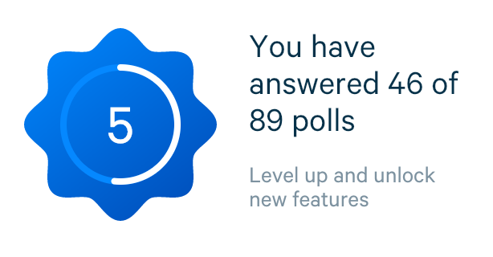

# Documentation for Appinio Flutter Project

- [Documentation for Appinio Flutter Project](#documentation-for-appinio-flutter-project)
  - [Animation](#animation)
  - [Apis](#apis)
  - [Components](#components)
    - [Ahievements](#ahievements)
    - [Action Sheets](#action-sheets)
    - [Badges](#badges)
    - [Buttons](#buttons)
    - [CountDown Timer](#countdown-timer)
    - [Create Poll](#create-poll)
    - [Diary](#diary)
    - [Level](#level)
    - [My Polls](#my-polls)
    - [Onboarding](#onboarding)
    - [Onboarding Login](#onboarding-login)
    - [Poll Card](#poll-card)
    - [Poll Card View](#poll-card-view)
    - [Poll Header](#poll-header)
    - [Poll Screen Countdown](#poll-screen-countdown)
    - [popups](#popups)
    - [Profile](#profile)
      - [Profile Sliver](#profile-sliver)
    - [Ranking](#ranking)
    - [Setting](#setting)
    - [Survey Cards](#survey-cards)
    - [Survey Notification Flashbar](#survey-notification-flashbar)
    - [Toasts](#toasts)
    - [Vouchers](#vouchers)
  - [Data](#data)
  - [Flutter Survey Module](#flutter-survey-module)
    - [Components](#components-1)
    - [Models](#models)
  - [Helper](#helper)
  - [l10n](#l10n)
  - [Models](#models-1)
  - [Navigator](#navigator)
  - [Screens](#screens)
  - [Services](#services)
  - [Style](#style)

## Animation

Customized animation widgets used in the project.

* ExpandAnimation: animation used to expand a widget from small to big.


* OpacityAnimation: animation used to transform a widget from transparent to visible.


* TranslateXAnimation: animation used to transfer in horizontal direction with fade-in effect.
* TranslateYAnimation: animation used to transfer in vertical direction with fade-in effect.


* CountupAnimation: animation used to display a number in a string with "counting-up" animation.
* ShakeAnimation: animation used to shake a widget for a defined period.


## Apis

A list of api helpers to interact with server. These are the functions that directly call `post`, `pull`, `put`, `get` to the server. Most of the logic are handled in the `Services` instead of here.

* AuthApi: authentication API including `login`, `logout`, `signup`, `password_reset`, etc. It also keep the token for the management of current active user.
* BadgesApi: functions for getting the users currently achieved badges. It can be found at `BadgeScreen` at user profile.
* CurrentUserApi: information about the current user, includes all the functions with user details like `zipcode`, `localization`, `username` etc.
* FollowApi: functions to handle interactions between users, including `follow`, `unfollow`.
* LevelsApi: function to obtain the general configuration of the applicaiton logic defined for levels, including which level users are allowed to ask questions, how much coins users need to reach next level, etc.
* NetworkingUtil: base helpers to handle network requestings.
* NewsApi: function to check update on new polls and new followers.
* PollsApi: a list of functions to handle quickies, including `bookmark`, `delete`, `vote`, `answer`, etc.
* RankdingApi: functions to ask about ranking status.
* SurveyApi: functions to get surveys, submit surveys, etc. Surveys are the quetionaires distributed by Appinio directly.
* TargetGroupsApi: a function to get a list of available target groups which the user can ask questions to.
* UsersApi: functions to fetch status of other users' profiles.
* VoucherApi: functions to order vouchers or directly paypal payout.
* ZipcodeApi: function to check the zipcode of the current user's location.

## Components

This is a list of small widgets that are used throughout the project, except for the ones that are used within the survey, which are then lcoated inside of `Survey` folder direclty. Different widgets are grouped together depending on where they are used and their usage logic.

### Ahievements

The widgets located at profile screen. `AchievementSlider` are used for the display of `AchiementCard`s, including level etc. On clicking, the device will be routed into a new screen for detail.

`BasicCardsSlider` and `BasicSliderCard` here can be reused as a base displayer for other cards functions.


### Action Sheets

The widgets that are used to display an action sheet poping from the bottom with options.


### Badges

The widgets that are used to implement the scroll view inside of `BadgesScreen`. This includes the `Troohy` logo on the top of the page, and the text widget.


### Buttons

Different buttons with a consistent appinio design style. A defualt button is provided with different parameters to customize.


### CountDown Timer

### Create Poll

Widgets used inside the create poll page. Mostly including `Forms` and `TextField`.


### Diary

### Level

level related widgets to display the user's current level and information.



### My Polls

Different design for the my polls screen. 


### Onboarding

Widgets related with onboarding page. Mostly `PageView` and `Positioned` widgets are used here to create a parallex sliding effect.


### Onboarding Login

Widgets used in the onboarding login / signup page. Mostly is about the `TextField` widgets.


### Poll Card

The pollcard related widgets that has been used in the `PollsScreen`. `PollCardSwiper` is a powerful widget that helps to create the card sliding effect with super fluent animation.


### Poll Card View

When displaying poll cards else where, certain functions are not offered. To keep things clean, a separated pollcard view is offered. The usage can be found in bookmark page.

### Poll Header

The widgets that has been used to implement the pollheader. The pollheader is located above the polls in poll tab.


### Poll Screen Countdown

When the polls stack is empty, the pollscreen countdown is lauchned to keep the time till next swiping of poll cards.

### popups

Different popup widgets with a default design. For different UI outlook, the popup can be found at the bottom of developer screen.


### Profile

Widgets that has been used in profile tab. Mostly the profile header widget. 

#### Profile Sliver

The custom widget that allows the scrolling of a widget with a background capable of scaling. The animation effect is currently used in profile page.

### Ranking

Widgets that has been used in ranking screen.

### Setting

The widgets that has been used in settings screen.


### Survey Cards

The survey tab that is being displayed in the `Coins Screen`.  When there are surveys, corresponding survey cards are being displayed which take the user to the corresponding survey. When no surveys are available, the no survey cards are being displayed which contains to buttons of call for action: `Answer Poll` and `Turn On Notification`. `Notification` is handled by the package `Permission Handler` which also consist of the funciton to navigating user to the native settings page to turn on Notification.


### Survey Notification Flashbar

### Toasts

The smaller notication for user. Either it contains an error, a general information, or a success notification.


### Vouchers

All the widgets that are assocaited with vouchers, including the voucher cards and the voucher detail screen.

## Data

All the constant data are stored here accordingly.

* Countries: location related information, including language locale etc.
* DiaryData
* Duration: **Note**: all the duration needs to be put here as constants.
* misc: All the other miscelleous constant data.
* urls
* weekdays

## Flutter Survey Module

A submodule contains all the survey related widgets and informaiton. To successfully run this submodule, please perform the following to configure the submodule:

```
cd lib/flutter-survey-module
git submodule init
git submodule udpate
```

When not working, also try `git submodule update --init --force --remote` which is the update command for git version 2.7.4.

### Components

Contains all the relevant widgets used in surveys. For a list of questions types, please see the following:

QuestionTypeInfo: 


QuestionTypeMC


QuestionTypeImage


QuestionTypeRanking


QuestionTypeVideoPlay


QuestionTypeCaptureAudio


QuestionTypeMatrix


QuestionTypeCapture


Implicit means: after for displaying for a certain amount of time, even if the user has not chosen an answer, the current question will be passed, and the survey willl move on to the next question.

### Models

All the survey related data models. 

## Helper

All the extra files that do not fit anywhere else but are able to assist the programming.
extensions: 
scale_route:
widget_size: A helper that is able to return the size of widget when the widget is built.

## l10n

The language locales files that contains the translations for all the strings in the project. The matching and processing of the .arb files are provided by Flutter.

Grammar for the l10n files:

* A general phrase
```
"actionSheetDownVote2": "Inappropriate content",
  "@actionSheetDownVote2": {
    "type": "text"
  },
```

* A phrase with blanks left for runtime
```
"ageTooYoung": "You need to be at least {minAge} years old to use this app",
  "@ageTooYoung": {
    "type": "text",
    "placeholders": {
      "minAge": {}
    }
  },
```

To use the translation file, simply find the id. First import `import 'package:flutter_gen/gen_l10n/app_localizations.dart';`, then use `AppLocalizations.of(context).id` as string.

## Models

All the data models are stored in this subject. It includes the detailed description of all the parameters for different objects, along with the hierachy relationship.

## Navigator

## Screens

A most important files to begin with. This files usually contains the starting points of each different screens. For each screen, we put a screen file here. **It is important to keep the content of these files strucutured, clean, and as concise as possible.**

## Services

A list of files that containst the upper layer functions for different services we used in the app. Instead of calling the API native calls directly from different widgets, services provide an interface that hides the lower layer logic.

* Adjust Service: 
* Badge Service: The functions used to fetch all the available badges information (badges count, rewarded badges, etc.) for the current user.
* Bottom Modal Service: The bottom modal service that can be used to display a bottom modal sheet. `showBottomModalFullScreen` function is used when you want to obtain a string after the bottom modal is closed. 
* Connection Service: call apis to check the connection of internet.
* Current User Service: a list of functions to obtain the related information about the current user, udpating the informaiton of the current user. The information could include: username, user level, user coins, etc.
* Deep Link Service:
* Device Service: When a user wants to report a bug back to appinio, device service can find the relevant information about the device the user is using.
* Diary Service:
* Easter Egg Service: This is a widget keeps the track of user activity (screens the user visited, polls the user asked). When the conditions are met, the user could be rewarded.
* File Service:
* Image Uploader Service: A list of funcitons to upload images. This is used by a survey question type.
* Init App:
* Language Service: the functions provided to user to allow them to change the languages settings.
* Local Storage Service: when certain key information needs to be stored locally, this service can be used.
* Locale Service: find the current locale the user is using.
* Location Service: obtain the current location of user and return to the server.
* Mixpanel Service:
* Navigation Service: a list of functions to route between pages. 
* Notification Service: a list of functions to push notifications to user.
* Poll Service: a list of function to deal with quickies: bookmark, report, submit, delete, etc.
* Popup Service: functions to display the popup. 
* Ranking Service: functions used to query the ranking of current user.
* Rating Service: functions to handle whether to ask user to rate our app.
* remote config service: the configurations that applied differently to users. Especially during the testing of new features, only a certain users will be asked to test the features first.
* Screenshot Service: the service to take the screenshot of a widget.
* Share Service
* Storage Service: secure storage functions provided by `FlutterSecureStorage`.
* Target Group Service: when asking a poll, a certain group needs to be assigned to question the poll. This service provides the ids and names of the groups.
* Tracker Service: A list of functions to track the screens the user has visited.
* Voucher Service: a list of functions to verify the user's status and then purchase the corresponding voucher or a paypal payout.
* Watch Service: the functions used to watch the changes of user's status and notify the user: new surveys, new badges, rank changes.

## Style

The constants that the app used. 

* AppinioIconsIcons
* AppinioTabIconsIcons
* Colours
* Constants: contains all the background, text, and icon colors, all the font sizes, all the linear gradients. **It is important to use all the `k` constants to keep style in sync.**
* PollCardColors: The color combination of text color and linear gradient designed specially for Poll Cards.
* Theme: differemt color setup when changing from light theme to dark theme.